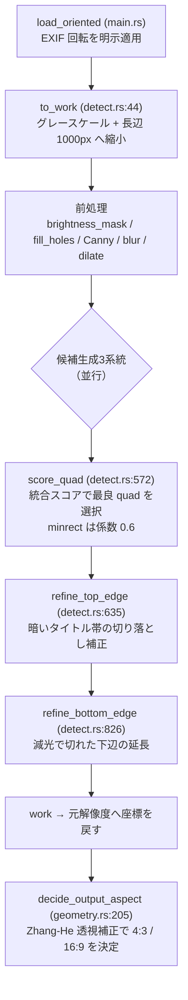
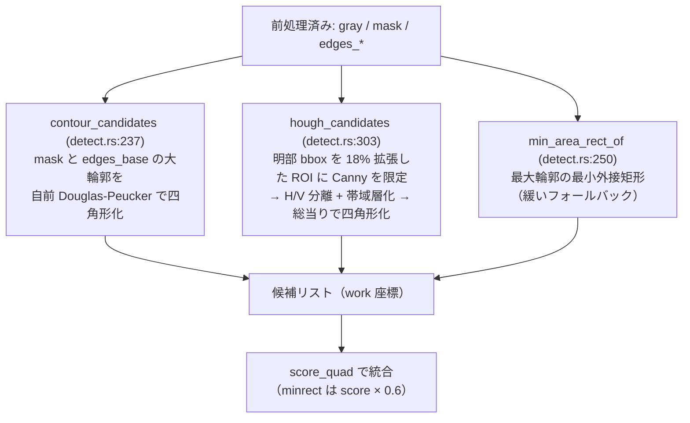

# Rust 本体のスライド領域認識方式

このドキュメントは **Rust 本体（`src/*.rs`）が実装しているスライド矩形領域の認識方式**を、
実装に即して一本にまとめた技術リファレンスである。役割分担は次の通り:
[`docs/tech-stack.md`](./tech-stack.md) の §5 が**言語非依存**の多段フォールバック設計方針（Python/Rust 共通の思想）、
本ドキュメントが**Rust 実装に即した**関数・数値・挙動の解説、[`../CLAUDE.md`](../CLAUDE.md) の「検出の設計要点」節が
エージェント向けの要点サマリ＋本ドキュメントへのポインタである。**認識アルゴリズムは Rust 本体が正**であり、
本文中の重み・しきい値・挙動は必ず `src/detect.rs` / `src/geometry.rs` / `src/warp.rs` / `src/main.rs` を一次情報源とする
（各数値の直後に出典関数名・ファイル:行を併記するが、**乖離した場合はソースが正**）。

対象スコープは**検出＋幾何確定まで**、すなわち「前処理 → 候補生成3系統 → `score_quad` による選択 →
上下辺リファイン → `decide_output_aspect` による出力アスペクト決定」である。強調処理（シャープ化 / 露出 / 色）・
CLI / バッチ・`report.html` は本ドキュメントの対象外。warp（透視変換の実行）は落とし穴（§7）のみ触れる。

## 1. 概要

課題は「暗い会場の中に映る明るいスライド矩形」を、スライドが画角からはみ出す・観客の頭や講演者が辺を
隠す・暗所/逆光といった悪条件でも頑健に検出することである。単一手法では破綻するため、**多段フォールバック**
を採る: 明度事前分布（暗所中の明るい矩形）を起点に、性質の異なる候補生成を3系統並行させ、統合スコア
`score_quad` で1つを選ぶ。選択後に上下辺リファインで枠の切り落としを補正し、最後に真アスペクトを復元して
出力比（4:3 / 16:9）を決める。エントリポイントは `detect_slide`（`src/detect.rs:906`）。



## 2. 前処理

- **EXIF 回転の明示適用**: `load_oriented`（`src/main.rs:25`）。`image` crate は EXIF Orientation を
  自動適用しないため、`ImageDecoder::orientation` を読み `apply_orientation` を手動で掛ける。Python 版の
  `cv2.imdecode` が回転を適用するのに揃えている（未適用だとスマホ縦持ち撮影が横倒しになる）。
- **作業解像度化**: `to_work`（`src/detect.rs:44`）。グレースケール化し、長辺を `WORK_LONG_SIDE = 1000`px
  （`detect.rs:15`）へ縮小して以降の処理を高速化する。倍率 `scale` は最後に元解像度へ戻すため保持する。
- **明度マスク** `brightness_mask`（`src/detect.rs:74`）: `gaussian_blur_f32(2.0)` → 大津しきい値
  `otsu_level` と 75 パーセンタイル（下限 90）の OR で二値化 → モルフォロジー `close` ×2（`Norm::LInf` 半径4）
  → `open` ×1。暗所中の明るい screen 領域を大まかに切り出す。
- **穴埋め** `fill_holes`（`src/detect.rs:89`）: 外周から到達できない内部の暗領域（スライド内の暗い図版など）
  を前景で埋める。フラッドフィルで「外周から背景色で到達可能」な画素を求め、残りの背景画素を前景化する。
  スコアの `fill` 項はこの穴埋め版マスクを使い、内部の暗図版で精度が不当に下がらないようにする。
- **エッジ / ぼかし**（`detect_slide` 内 `src/detect.rs:911-914`）: `gray_blur = gaussian_blur_f32(1.5)`、
  `edges_base = canny(50,150)`、`edges_lo = canny(40,120)`、`edges_dil = dilate(edges_lo, LInf, 2)`。
  用途別に閾値の異なる Canny を使い分ける（`edges_base` は contour、`edges_lo`/`edges_dil` は Hough とスコアリング）。

## 3. 候補生成3系統

3系統は独立に quad 候補を生成し、`detect_slide`（`src/detect.rs:924-951`）で1つのリストへ集約されて
`score_quad` に掛けられる。性質が異なるため、いずれか1系統でも真の枠を出せれば拾える設計。



### contour（`contour_candidates`, `src/detect.rs:237`）
明度マスクと `edges_base` の両方から、面積上位6件の輪郭（`largest_contours`）を取り、`approx_quad`
（`src/detect.rs:179`）で四角形化する。`approx_quad` は **自前の Douglas-Peucker**（`dp` / `perp_dist`,
`src/detect.rs:144-177`。OpenCV の `approxPolyDP` は使えない）で、許容誤差を周長の 2% / 4% / 6% と段階的に
上げながら頂点数がちょうど4になった時点で採用し、`is_convex` で凸性を確認する。

### hough（`hough_candidates`, `src/detect.rs:303`）
辺の一部さえ見えれば四隅（画角外含む）を外挿できる、はみ出し・オクルージョン対策の要。

1. **ROI 限定**: 明部 bbox（`bright_bbox`）を各方向 **18%** 外へ拡張（`mx = 0.18*bw`, `my = 0.18*bh`,
   `detect.rs:309-310`）した矩形へ `canny(40,120)` を限定し、`ignore` 領域（人物マスク等）も消す。
2. **直線検出**: `detect_lines`（imageproc 標準 Hough）。`vote_threshold = max(0.12*長辺, 40)`
   （`detect.rs:334`）、`suppression_radius = 12`。**返るのは極線 `(r, θ)`** であって線分ではない。
3. **H/V 分類**: 法線角 θ で分類（θ<35 or θ>145 → 垂直線、55<θ<125 → 水平線, `detect.rs:349-353`）。
4. **帯域層化**: bbox 中心線を基準に、水平線を上帯/下帯（中心 x での y 座標 `hy` で判定）、垂直線を左帯/右帯
   （中心 y での x 座標 `vx`）へ振り分け、各帯で投票の強い順に `top_k = 4` 本だけ残す（`detect.rs:365-387`）。
   これにより本物の外周線の生存率を上げる。
5. **四角形化**: 上×下×左×右の総当りで、極線同士の交点 `polar_intersection`（`detect.rs:287`。線分ではないため
   極線方程式から直接算出）で四隅を作り、画角の -0.5〜1.5 倍を超える極端な外挿は棄却する（`detect.rs:397-405`）。

### minrect（`min_area_rect_of`, `src/detect.rs:250`）
最大輪郭の最小外接矩形。最後の緩いフォールバック。`min_area_rect` は定義上 `rect=1.0`（完全な矩形度）を
取り過信を招くため、選択時に **信頼度へ係数 0.6** を掛ける（`detect_slide` 内 `src/detect.rs:957-959`）。

## 4. 統合スコア `score_quad`

`score_quad`（`src/detect.rs:572`）は各候補を7項の重み付き和で採点する。非凸は除外、面積比が
**下限 0.04 / 上限 1.6** の範囲外も除外する（`detect.rs:587`）。重みと定義（`detect.rs:608-614`）:

| 項 | 重み | 内容 | 出典 |
|----|------|------|------|
| `area_score` | 0.12 | 面積比 0.04〜1.6 を台形状に評価 | `detect.rs:590` |
| `rect` | 0.05 | 矩形度（内角が 90° にどれだけ近いか） | `geometry.rs:54` |
| `aspect_score` | 0.06 | 定番比（4:3/16:9/16:10/3:2）へのスナップ、なければ 4:3 との距離 | `detect.rs:593-597` |
| `contrast` | 0.12 | 内部平均と外部平均の明度差 | `contrast_of`, `detect.rs:532` |
| `fill` | 0.20 | 内部が明度マスクで埋まる割合（**`fill_holes` 版マスク**を使用） | `detect.rs:600-604` |
| `edge` | 0.25 | 方向付き edge_support（各辺が実エッジに乗る割合） | `edge_profile`, `detect.rs:426` |
| `cut_score` | 0.20 | `1 - min(1, 1.5*cut)`（cut は辺が明部を素通しで横切る度合い） | `detect.rs:606` |

重みの合計は 1.0。`edge` と `cut` は関数 `edge_profile`（`src/detect.rs:426`）が各辺を **法線方向にサンプリング**
して同時算出する（Mermaid に馴染まないので以下に文章で補足する）:

- **方向付き edge_support（edge）**: 各辺上を 48 点サンプルし、法線オフセット `d = clamp(0.03*√area, 4, 14)`
  だけ内外へずらした明度を見る。エッジに乗っていて **内側が外側より 10 以上明るい**（内側明・外側暗＝真の枠）
  なら `1.0`、エッジには乗るが内外とも明るい**内部線**（表罫線・文字行）は係数 **0.5** に半減する
  （`detect.rs:460-468`）。辺ごとの割合から `edge = 0.5*mean + 0.5*min`（`detect.rs:488`）。min を混ぜることで
  「1辺でも枠に乗っていない候補」を抑える。
- **cut（recall の局所版）**: 辺が明部を素通しで横切る度合い。内側明 ∧ 外側明 ∧ さらに外側（2d/3.5d）に
  エッジ（テクスチャ）があると `cut_sum` を加算（`detect.rs:470-476`）。スライドの一部だけを囲む小矩形の切断辺で
  高くなる。辺の外側近傍だけを見るため、大域 coverage と違い**天井・明壁で汚染されない**（平坦な外側は cut に
  ならない）。`cut_score = 1 - min(1, 1.5*cut)`（`detect.rs:606`）で減点に変換する。

⚠ **sub-slide 誤り（スライドの一部だけを切り出す）対策の主役は cut と方向付き edge の2項**である。
「内部の強いエッジで囲まれた小矩形」が edge_support だけでは高得点になってしまう問題への対処なので、
重みを調整する際はこの2項の役割を崩さないこと。`contrast`（内部が暗い会場に対し明るい）も、内部小矩形が
低スコアになる方向に効く補助項。

## 5. 上下辺リファイン

検出確定後の後処理。候補生成・スコアリングを一切変えず、選択済み quad の上辺/下辺だけを法線方向へ延ばす
（`detect_slide` 内 `src/detect.rs:977-983` で `refine_top_edge` → `refine_bottom_edge` の順に適用）。
候補・スコアを変えないため回帰しにくいのが設計上の利点。共通の要は**損失非対称**: 切っても内容損失ゼロな辺
（空の余白/レターボックス/非投影マージン）は動かさず、**帯に実コンテンツがある時だけ**辺を広げる。

### refine_top_edge（`src/detect.rs:635`）
上辺が「本文の明暗境界」に張り付き、暗いタイトル帯や上部の暗ベゼルを切り落としている場合に、真の上端まで
上辺を延ばす。

- **発火の前提**: 内側（-6px）が明部、かつ外側（+6px）が「マスク非明部」または「gray で本体より暗い」
  （`BAND_DELTA = 12`, `detect.rs:697-708`）。白スクリーンの外側余白（外側も同輝度で明るい）はここで除外。
- **走査**: 法線外側へ `o_max = 0.24*height` まで走査し、帯の終端を示す3種の候補位置を探す —
  P2（明るさ再出現＝帯→天井/マージンの境界に枠エッジ）、P1（帯内の強直線で、さらに外側が静かに暗い最外周枠）、
  P3（枠線が弱い時のフォールバック＝最外コンテンツ行 +6px）。優先順位は `p2 → p1 → p3`（`detect.rs:800`）。
- **コンテンツ判定**: 帯内の「文字テクスチャがある行」を Canny エッジ密度（`edges_raw`/`edges_dil`）で判定する
  （`detect.rs:759-760`）。エッジ皆無の半明行（投影光のスピル・ぼけたレターボックス）は数えない。
  **コンテンツ行がスナップ線より内側に2行以上あること**を発火条件にする（`detect.rs:770,806`）。
- 帯継続の前提は gray 値ベースで判定するため、`close` でマスク上「明」に化けた暗青帯・黒帯+白文字も拾える。

### refine_bottom_edge（`src/detect.rs:826`）
`refine_top_edge` と対の明部継続版。プロジェクタ下部の減光で明度マスクがスライド下部を早期に切り落とすと、
下辺は「内側=明・外側も本体並みに明るい（スライドが続いている）」に張り付く。この時だけ、gray 輝度が
本体基準から暗転する位置まで下辺を延ばす。

- **発火の前提**: 本体が明るい（`g_body >= 120`, `detect.rs:859`）かつ外側が本体並みに明るい
  （`CONT_DELTA = 22`, `detect.rs:864-868`）。正しい下辺の外側（会場・壁・机・観客）は即座に大きく暗転するので
  発火しない。
- **走査**: 左右半分を独立に `o_max = 0.4*height` まで走査し、`DARK_DELTA = 45` 以上暗転する位置を終端とする
  （`detect.rs:872-887`）。左右2点から辺両端へ線形外挿することで、辺の傾き残り（回転ずれ）にも追従する。
  延長が僅か（<12px）または左右の食い違いが大きすぎる（>60px）場合は誤検知保護で発火しない（`detect.rs:889`）。

## 6. 出力アスペクト決定

出力比は必ず **4:3 か 16:9** の2択。斜め撮影では見かけの辺長比（`estimate_aspect`, `geometry.rs:71`）が
16:9 のスライドでも縮んで誤って 4:3 に見えるため、これを直接は使わず **Zhang-He のホワイトボード透視補正**で
真アスペクトを復元してから判定する。決定は `decide_output_aspect`（`src/geometry.rs:205`）。

### rectified_aspect（`src/geometry.rs:144`）
主点＝画像中心・正方画素を仮定し、四隅から2組の消失点方向ベクトル `n2`/`n3` を作る。両者の直交条件から焦点距離
`f` を推定し、真の幅²/高さ² の比 `√(w²/h²)` を復元する（`geometry.rs:183-196`）。`persp = max(|n2[2]|, |n3[2]|)`
（`geometry.rs:167`）は透視の強さの指標。ほぼ平行四辺形（`persp < 1e-3`）なら f 不要で直接算出、一点透視や
f が虚数/範囲外（`0.2..3.5` 外）の場合は復元不能として `None` を返す。

### decide_output_aspect のしきい値（`src/geometry.rs:199-229`）
関連定数（`geometry.rs:199-202`）:

```rust
const PERSP_RECTIFIED_MAX: f64 = 0.12; // 透視補正値を採る許容 persp 上限
const PERSP_APPARENT_MAX: f64 = 0.05;  // 見かけ比フォールバックの許容 persp 上限
const AGREE_LOG_TOL: f64 = 0.10;       // 復元値と見かけ比の一致許容（log 比）
const ASPECT_43_MAX: f64 = 1.45;       // 4:3 と判定する比の上限
```

判定ロジックは「**確度が高くない限り 16:9**」方針を、次の段階で実装する:

1. 復元値 `rec` と `persp` が得られ、`persp < 0.12` **かつ** 復元値が見かけ比と log スケールで整合する
   （`|ln(apparent/rec)| < 0.10`, `geometry.rs:212-213`）なら、採用比 `r = rec`。
2. 上で決まらず、透視が非常に弱い（`persp < 0.05`, `geometry.rs:220`）なら、見かけ比 `r = apparent`。
3. 採用比 `r` が **`1.05 < r < 1.45`** の範囲にあるときだけ 4:3、それ以外（`r` 未確定・広い比・強い斜め）は
   すべて 16:9（`geometry.rs:225-228`）。

> ⚠ **CLAUDE.md の記述との差**: CLAUDE.md は「`persp<0.12` かつ比 `<1.45` のとき 4:3」と要約するが、
> ソース上の実条件はより厳密で、(a) 復元値採用には persp<0.12 **に加えて** 見かけ比との log 一致
> （`AGREE_LOG_TOL=0.10`）が必要、(b) それとは別に persp<0.05 の見かけ比フォールバック経路がある、
> (c) 4:3 ゲートは上限 1.45 だけでなく**下限 1.05**も持つ。しきい値 `1.45` は
> インラインリテラルではなく名前付き定数 `ASPECT_43_MAX`（`geometry.rs:202`）として存在する。
> **値・条件はソースが正**。

## 7. Rust 固有の実装差・落とし穴

- ⚠ **imageproc の warp は「入力→出力」の射影を渡す**: `Projection::from_control_points(src, dst)`
  （`src/warp.rs:54`。src=スライド四隅、dst=出力矩形）。内部で逆写像してサンプルするため、src と dst を
  逆にすると出力が黒枠内に小さく歪んで崩れる（過去に踏んだ）。
- **Hough は極線 `(r, θ)`**（線分ではない）。交点は極線方程式から直接計算する（`polar_intersection`,
  `src/detect.rs:287`）。帯分けも線分中点ではなく極線の位置（`hy`/`vx`）で行う。Python 版の確率的 Hough
  （線分ベース）とはここが実装上異なる。
- **approxPolyDP 相当は自前の Douglas-Peucker**（`dp`/`perp_dist`/`approx_quad`, `src/detect.rs:144-206`）。
  OpenCV に依存しない純 Rust 実装のため。
- **EXIF 回転は自前で明示適用**（`load_oriented`, `src/main.rs:25`）。`image` crate は自動適用しないので、
  `apply_orientation` を手動で呼ぶ（Python の `cv2.imdecode` は適用するのに合わせている）。
- ⚠ Rust では `x as f64 < y` がジェネリック境界と誤解されコンパイルエラーになる。`(x as f64) < y` と
  括弧を付ける。
- ビルド: `cargo build --release` は LTO 有効で約2分かかる。反復は debug ビルド、最終確認だけ release。

## 関連ドキュメント

- [`docs/tech-stack.md`](./tech-stack.md) §5 — 言語非依存の多段フォールバック設計方針。
- [`../CLAUDE.md`](../CLAUDE.md) — リポジトリ規約・検出の設計要点サマリ・運用手順（eval-output 再生成など）。
- 一次情報源: `src/detect.rs` / `src/geometry.rs` / `src/warp.rs` / `src/main.rs`。
